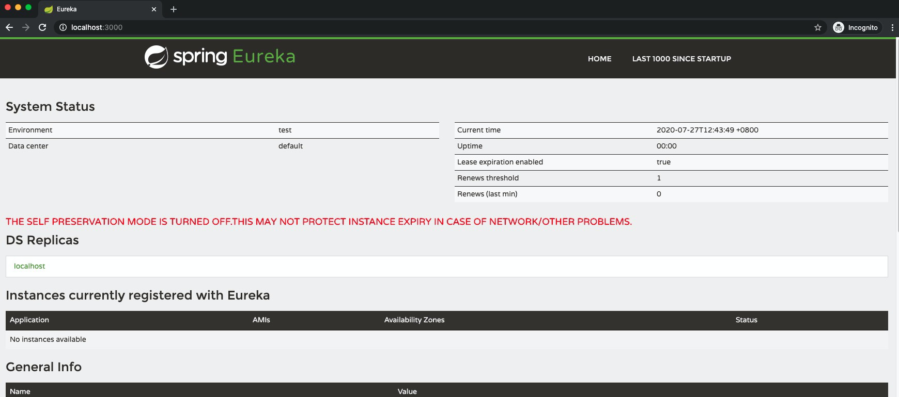
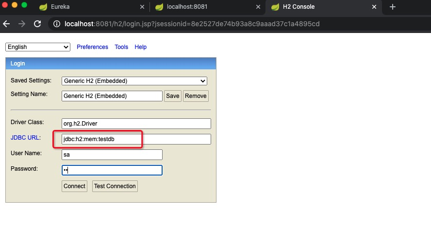

# introduce modules
	trafigura-parent: parent project
    - trafigura-biz-shipment: shipment business project 相关业务整合
    - trafigura-biz-shipment-dbstore: activemq project /supporting update database
    - trafigura-utils-api-lock-jdbc: 使用h2限制重复请求的校验，以防止短时间内重复提交和网络抖动
    - trafigura-infra-eureka: eureka project/ registe center
    
## usage

### 1首先启动 trafigura-infra-eureka 项目
	http://localhost:3000
  

### 2 start trafigura-biz-shipment project
	http://localhost:8081

### 3 database h2
	http://localhost:8081/h2
	url: jdbc:h2:mem:testdb
	default username and password: sa/sa
  

## Data protection mechanism;
	使用spring的切面变成，对重复数据提交进行限制，设计LOCKS表，记录token，防止短时间内重复请求
	请参考 trafigura-utils-api-lock-jdbc 项目
## Parameter protection mechanism;
	使用validate限制
	时间原因没有整合 spring security，会对接口进行限制
## Interface exception definition;
	使用 Exception Handler 对系统报错 进行封装 请参考BizExceptionHandler文件

## 引入activeMq，将做到 update /insert 与 query分离。
	对所有的insert和update统一使用mq调度.保证一致性。
	其他获取数据的query，使用jpa直接获取数据

## 由于使用spring security 做api接口的auth2认证
### 1 访问一下地址获取token
	http://localhost:8081/oauth/token?username=user_1&password=123456&grant_type=password&scope=server&client_id=client_2&client_secret=123456
### 2 其他接口访问方式
	http://localhost:8081/?access_token=56268c63-65e0-49a2-a754-dce8e36bfd75
	本项目中以下url需要token权限
	/
	/user/**
	/db/**
	/shipment/**

### POSTMAN接口请求地址
	https://documenter.getpostman.com/view/574360/T1Dqhd7E